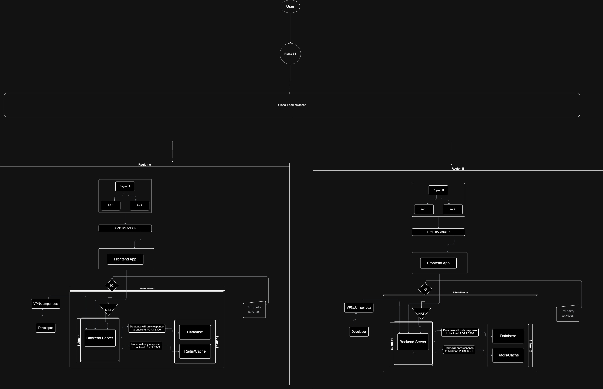

# real-estate-network-design

### Here is the network design:

### List of all assumptions for the design:

- **Route 53**: For routing users to appropriate destination 
- **Regions & AZ**: For apply application in different regions and AZ for better performance and keep live the system even in disester
- **Load Balancer**: It will help the system auto scalling
- **S3/CDN**: For better and fast static files serve
- **VPS**: For secure the system we need VPS, it will protect trafic from internet
- ***Internet Gateway**: For access the system to internet 
- **NAT**: This will allow a subnet to get trafic from internet. it is network address translator.
- **Subnets**: In VPS we need to separete our vital system from others. It will separate systems in VPS
- **Security Groups**: For allow/deny what exactly need in networks, instances
- **VPN/Jump box/SSH** For allow developers to work their developement inside networks, system